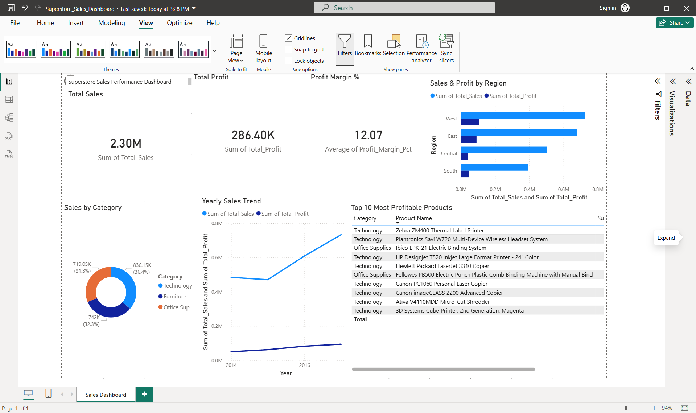

# 🛒 Retail Sales Performance Dashboard

## Project Overview
Analysed 9,994 retail transactions from the Superstore dataset to uncover 
sales trends, regional performance, and product profitability using 
Python, SQL, and Power BI.

## Dashboard Preview

## Key Insights
- 💰 **$2.3M** total sales across 4 regions (2014–2017)
- 🏆 **West region** leads with 14.9% profit margin
- 📉 **Tables & Bookcases** are loss-making (-$17K, -$3K profit)
- 🖥️ **Technology** drives 36.4% of total revenue
- 👥 **Corporate** customers have highest avg spend ($2,992)

## Tools Used
| Tool | Purpose |
|------|---------|
| Python (pandas) | Data loading & cleaning |
| SQL (SQLite) | Data aggregation & analysis |
| Power BI | Dashboard & visualisation |
| Excel | Data export & formatting |

## Files
| File | Description |
|------|-------------|
| `load_data.py` | Loads CSV into SQLite database |
| `queries.py` | SQL queries for business insights |
| `export_for_powerbi.py` | Exports analysis to Excel for Power BI |
| `superstore_analysis.xlsx` | Clean exported data |

## How to Run
1. Download the Superstore dataset from Kaggle
2. Run `python load_data.py`
3. Run `python queries.py` to see insights
4. Run `export_for_powerbi.py` to generate Excel
5. Open Power BI and load `superstore_analysis.xlsx`
